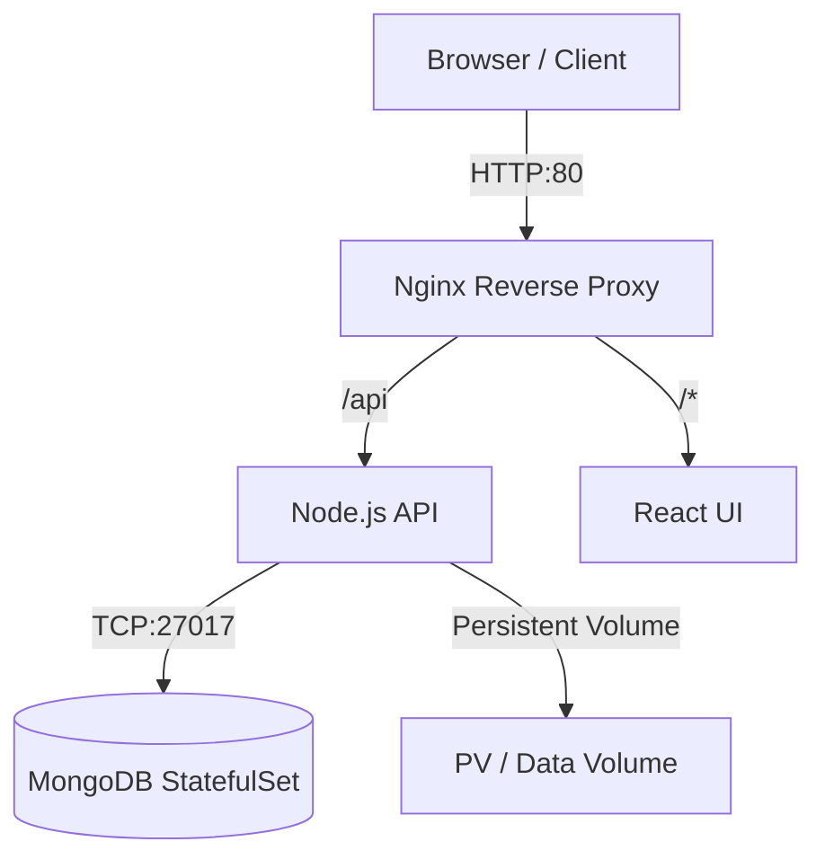

# Goober: Cloud-Native Trash Can Finder 🗑️📍

A full-stack distributed application designed to help communities locate waste disposal points efficiently. Refactored from a monolithic MERN stack into a **Cloud-Native Microservices Architecture** to demonstrate DevOps best practices, container orchestration, and automated CI/CD pipelines.

---

## 🏗️ System Architecture

This project decouples the legacy codebase into isolated services, managed by a reverse proxy and orchestrated via Kubernetes.

Key Features

🛠️ Infrastructure & DevOps
Microservices Architecture: Decoupled Frontend (React) and Backend (Node.js) into separate Docker containers to ensure isolation and scalability.
Kubernetes Orchestration: Deployed using Minikube with StatefulSets for database persistence and Ingress Controllers for traffic routing.
CI/CD Pipeline: Automated GitHub Actions workflow to build, test, and verify Docker images on every push to main.
Reverse Proxying: Configured Nginx as an API Gateway to route traffic and resolve CORS issues between services.

📱 Application Features
Interactive Mapping: Real-time geospatial tracking of trash cans using map integration.
Crowdsourced Data: Users can add new bin locations, report full bins, and verify existing data .
Smart Filtering: Filter bins by waste type: General, Recycling, Organic, or Hazardous .
Gamification: Badge system to reward top contributors for maintaining map accuracy .

🛠️ Tech Stack
Frontend: React.js, Tailwind CSS, Vite

Backend: Node.js, Express.js, RESTful API

Database: MongoDB, Mongoose

DevOps: Docker, Kubernetes (Minikube), Nginx, GitHub Actions

🔧 Installation & Setup
Option 1: Docker Compose (Local Dev)
Run the full stack locally with a single command.

# 1. Clone the repository
git clone [https://github.com/PhoneMk/Goober.git](https://github.com/PhoneMk/Goober.git)
cd Goober

# 2. Start services (builds images automatically)
docker-compose up --build
Frontend: http://localhost:3000

Backend API: http://localhost:5000

Option 2: Kubernetes (Minikube Deployment)
Deploy the microservices cluster to Minikube.

# 1. Start Minikube
minikube start --driver=docker

# 2. Load Images into Minikube
minikube image load goober-backend:latest
minikube image load goober-frontend:latest

# 3. Apply Manifests
kubectl apply -f k8s/

# 4. Access the Application
kubectl port-forward svc/goober-frontend 8080:80 -n goober

Access via: http://localhost:8080

🧪 CI/CD Pipeline
This repository uses GitHub Actions (.github/workflows/ci.yml) to ensure build integrity.

Trigger: Push to main.

Job: Sets up an Ubuntu runner, initializes Docker Buildx, and attempts to build both Frontend and Backend images.

Goal: Prevents broken code from merging and ensures Dockerfiles remain valid.

📂 Project Structure
├── .github/workflows  # CI/CD Pipeline definitions
├── k8s/               # Kubernetes Manifests (Deployments, Services, StatefulSets)
├── backend/           # Node.js/Express Microservice
├── src/               # React Frontend Microservice
├── docker-compose.yml # Local Development Orchestration
├── nginx.conf         # Reverse Proxy Configuration
└── Dockerfile         # Multi-stage Frontend Build
